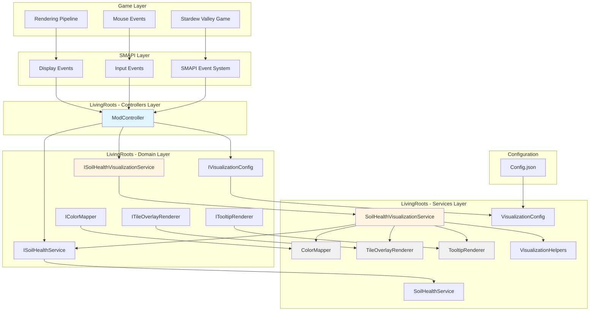
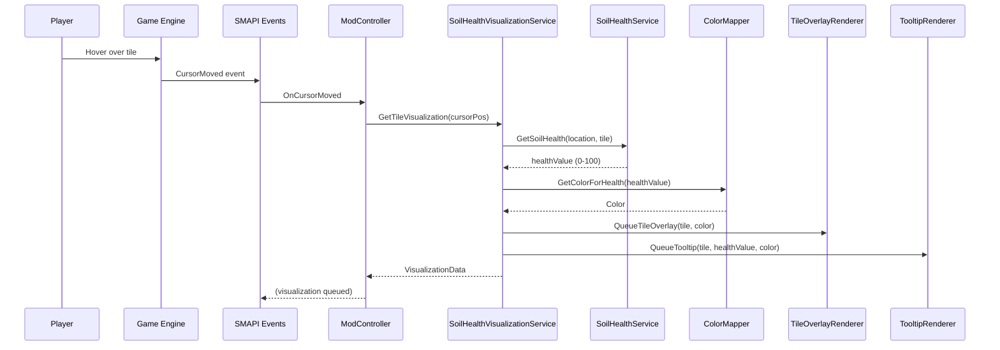
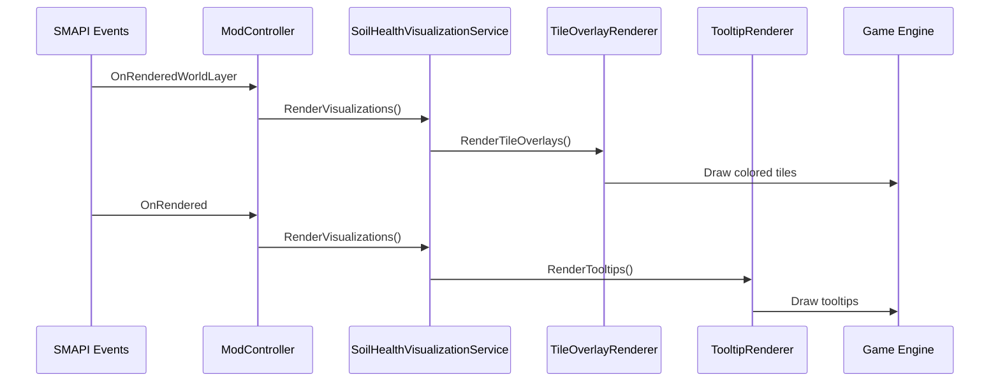
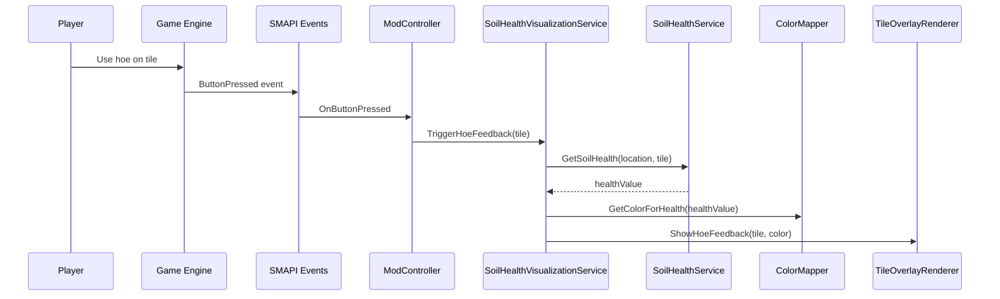
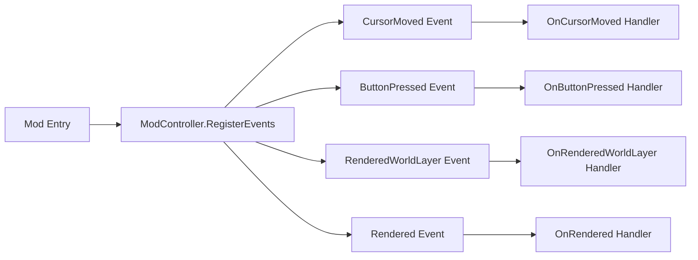
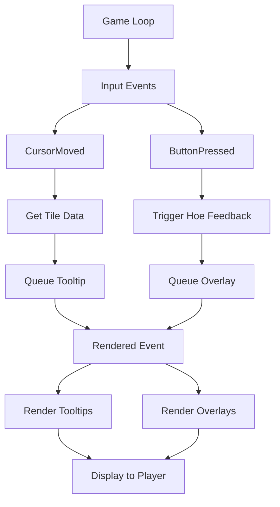

# Soil Health Visualization - Developer Guide

## Overview

This guide provides technical documentation for developers working on the soil health visualization system in Living Roots mod. It covers architecture, implementation details, extension points, and best practices.

## Architecture Overview

### System Design Principles

The visualization system follows these architectural principles:

1. **Separation of Concerns**: Clear separation between domain logic, services, and controllers
2. **Dependency Inversion**: High-level modules depend on abstractions, not concretions
3. **Testability**: All components are designed for easy unit and integration testing
4. **Performance**: Optimized rendering with viewport culling and caching
5. **Extensibility**: Clear extension points for future features

### Component Diagram



## Data Flow Diagram

### Hover Visualization Flow



### Rendering Flow



### Hoe Feedback Flow



## Class Responsibilities

### Domain Layer

#### ISoilHealthVisualizationService

**File**: [`LivingRoots/Domain/ISoilHealthVisualizationService.cs`](../Domain/ISoilHealthVisualizationService.cs:1)

**Purpose**: Interface for soil health visualization operations

**Key Methods**:
- `GetTileVisualization()` - Retrieves visualization data for a specific tile
- `GetColorForHealth()` - Maps health value to color
- `QueueTileOverlay()` - Queues overlay for rendering
- `QueueTooltip()` - Queues tooltip for rendering
- `RenderVisualizations()` - Renders all queued visualizations
- `ClearVisualizations()` - Clears all queued visualizations
- `ShowHoeFeedback()` - Displays hoe action feedback
- `SetVisualizationEnabled()` - Enables/disables visualization

#### IVisualizationConfig

**File**: [`LivingRoots/Domain/IVisualizationConfig.cs`](../Domain/IVisualizationConfig.cs:1)

**Purpose**: Interface for visualization configuration

**Key Properties**:
- `EnableVisualization` - Master switch for visualization
- `EnableTileOverlay` - Toggle tile overlays
- `EnableHoverTooltip` - Toggle hover tooltips
- `EnableHoeFeedback` - Toggle hoe feedback
- `OverlayOpacity` - Opacity of overlays (0.0-1.0)
- `PoorSoilColor` - Color for poor soil
- `ModerateSoilColor` - Color for moderate soil
- `HealthySoilColor` - Color for healthy soil
- `PoorSoilThreshold` - Upper bound for poor soil
- `ModerateSoilThreshold` - Upper bound for moderate soil
- `UseSmoothGradients` - Use smooth gradients

#### IColorMapper

**File**: [`LivingRoots/Domain/IColorMapper.cs`](../Domain/IColorMapper.cs:1)

**Purpose**: Interface for mapping health values to colors

**Key Methods**:
- `GetColorForHealth()` - Returns color for health value
- `GetHealthCategory()` - Returns health category

#### ITileOverlayRenderer

**File**: [`LivingRoots/Domain/ITileOverlayRenderer.cs`](../Domain/ITileOverlayRenderer.cs:1)

**Purpose**: Interface for rendering tile overlays

**Key Methods**:
- `QueueOverlay()` - Queues overlay for rendering
- `RenderOverlays()` - Renders all queued overlays
- `ClearOverlays()` - Clears all queued overlays

#### ITooltipRenderer

**File**: [`LivingRoots/Domain/ITooltipRenderer.cs`](../Domain/ITooltipRenderer.cs:1)

**Purpose**: Interface for rendering tooltips

**Key Methods**:
- `QueueTooltip()` - Queues tooltip for rendering
- `RenderTooltips()` - Renders all queued tooltips
- `ClearTooltips()` - Clears all queued tooltips

### Services Layer

#### SoilHealthVisualizationService

**File**: [`LivingRoots/Services/SoilHealthVisualizationService.cs`](../Services/SoilHealthVisualizationService.cs:1)

**Purpose**: Core visualization service coordinating all visualization components

**Responsibilities**:
- Coordinate between soil health data and rendering
- Manage visualization queues
- Apply configuration settings
- Handle viewport culling
- Provide visualization data to controllers

**Dependencies**:
- [`ISoilHealthService`](../Domain/ISoilHealthService.cs:1) - For retrieving soil health values
- [`IVisualizationConfig`](../Domain/IVisualizationConfig.cs:1) - For configuration access
- [`IColorMapper`](../Domain/IColorMapper.cs:1) - For color mapping
- [`ITileOverlayRenderer`](../Domain/ITileOverlayRenderer.cs:1) - For overlay rendering
- [`ITooltipRenderer`](../Domain/ITooltipRenderer.cs:1) - For tooltip rendering
- [`IMonitor`](https://stardewvalleywiki.com/Modding:Modder_Guide/APIs/IMonitor) - For logging

**Key Implementation Details**:
```csharp
public class SoilHealthVisualizationService : ISoilHealthVisualizationService
{
    private readonly ISoilHealthService _soilHealthService;
    private readonly IVisualizationConfig _config;
    private readonly IColorMapper _colorMapper;
    private readonly ITileOverlayRenderer _overlayRenderer;
    private readonly ITooltipRenderer _tooltipRenderer;
    private readonly IMonitor _monitor;

    public TileVisualizationData? GetTileVisualization(string locationName, Vector2 tile)
    {
        // Get health value from service
        float healthValue = _soilHealthService.GetSoilHealth(locationName, tile);

        // Check if health value exists
        if (healthValue < 0.0001f)
        {
            return null;
        }

        // Get color for health value
        Color color = _colorMapper.GetColorForHealth(healthValue);

        // Get health category
        HealthCategory category = _colorMapper.GetHealthCategory(healthValue);

        // Calculate screen position
        Vector2 screenPosition = CalculateScreenPosition(tile);

        return new TileVisualizationData(healthValue, color, tile, screenPosition, category);
    }
}
```

#### ColorMapper

**File**: [`LivingRoots/Services/ColorMapper.cs`](../Services/ColorMapper.cs:1)

**Purpose**: Maps soil health values to colors

**Responsibilities**:
- Map health values to colors
- Determine health categories
- Support both discrete and smooth gradient modes
- Cache color mappings for performance

**Dependencies**:
- [`IVisualizationConfig`](../Domain/IVisualizationConfig.cs:1) - For color and threshold settings
- [`IMonitor`](https://stardewvalleywiki.com/Modding:Modder_Guide/APIs/IMonitor) - For logging

**Key Implementation Details**:
```csharp
public class ColorMapper : IColorMapper
{
    private readonly IVisualizationConfig _config;
    private readonly Dictionary<int, Color> _colorCache = new();

    public Color GetColorForHealth(float healthValue)
    {
        // Clamp health value to valid range
        healthValue = Math.Clamp(healthValue, 0f, 100f);

        // Check cache
        int healthInt = (int)healthValue;
        if (_colorCache.TryGetValue(healthInt, out Color cachedColor))
        {
            return cachedColor;
        }

        // Get health category
        HealthCategory category = GetHealthCategory(healthValue);

        // Get color based on mode
        Color color = _config.UseSmoothGradients
            ? GetGradientColor(healthValue, category)
            : GetDiscreteColor(category);

        // Cache and return
        _colorCache[healthInt] = color;
        return color;
    }

    public HealthCategory GetHealthCategory(float healthValue)
    {
        if (healthValue <= _config.PoorSoilThreshold)
            return HealthCategory.Poor;
        else if (healthValue <= _config.ModerateSoilThreshold)
            return HealthCategory.Moderate;
        else
            return HealthCategory.Healthy;
    }
}
```

#### TileOverlayRenderer

**File**: [`LivingRoots/Services/TileOverlayRenderer.cs`](../Services/TileOverlayRenderer.cs:1)

**Purpose**: Renders colored overlays on tiles

**Responsibilities**:
- Queue overlay rendering requests
- Render overlays with proper opacity and blending
- Apply viewport culling
- Manage overlay lifecycle

**Dependencies**:
- [`IVisualizationConfig`](../Domain/IVisualizationConfig.cs:1) - For opacity settings
- [`IMonitor`](https://stardewvalleywiki.com/Modding:Modder_Guide/APIs/IMonitor) - For logging

**Key Implementation Details**:
```csharp
public class TileOverlayRenderer : ITileOverlayRenderer
{
    private readonly IVisualizationConfig _config;
    private readonly IMonitor _monitor;
    private readonly Queue<TileOverlay> _queuedOverlays = new();
    private const int MaxOverlaysPerFrame = 100;

    public void QueueOverlay(string locationName, Vector2 tile, Color color)
    {
        // Limit queue size
        if (_queuedOverlays.Count >= MaxOverlaysPerFrame)
        {
            _queuedOverlays.Dequeue();
        }

        _queuedOverlays.Enqueue(new TileOverlay(locationName, tile, color));
    }

    public void RenderOverlays(SpriteBatch spriteBatch)
    {
        if (!_config.EnableTileOverlay)
            return;

        foreach (var overlay in _queuedOverlays)
        {
            if (IsTileVisible(overlay.Tile))
            {
                RenderOverlay(spriteBatch, overlay);
            }
        }
    }

    private bool IsTileVisible(Vector2 tile)
    {
        // Check if tile is within viewport
        var viewport = Game1.viewport;
        var tileScreenPos = Utility.ModCoordinatesToScreenTile((int)tile.X, (int)tile.Y);
        return viewport.Contains(tileScreenPos);
    }
}
```

#### TooltipRenderer

**File**: [`LivingRoots/Services/TooltipRenderer.cs`](../Services/TooltipRenderer.cs:1)

**Purpose**: Renders hover tooltips with soil health information

**Responsibilities**:
- Queue tooltip rendering requests
- Format tooltip text with health value and category
- Position tooltips near cursor
- Handle tooltip styling

**Dependencies**:
- [`IVisualizationConfig`](../Domain/IVisualizationConfig.cs:1) - For tooltip settings
- [`IMonitor`](https://stardewvalleywiki.com/Modding:Modder_Guide/APIs/IMonitor) - For logging

**Key Implementation Details**:
```csharp
public class TooltipRenderer : ITooltipRenderer
{
    private readonly IVisualizationConfig _config;
    private readonly IMonitor _monitor;
    private readonly Queue<TooltipData> _queuedTooltips = new();

    public void QueueTooltip(Vector2 tile, float healthValue, Color color)
    {
        if (!_config.EnableHoverTooltip)
            return;

        HealthCategory category = GetHealthCategory(healthValue);
        string text = FormatTooltipText(healthValue, category);

        Vector2 position = CalculateTooltipPosition(tile);
        _queuedTooltips.Enqueue(new TooltipData(tile, text, color, position));
    }

    private string FormatTooltipText(float healthValue, HealthCategory category)
    {
        return $"Soil Health: {healthValue:F0}%\nStatus: {category}";
    }

    private Vector2 CalculateTooltipPosition(Vector2 tile)
    {
        Vector2 cursorPos = Game1.getMousePosition();
        return new Vector2(cursorPos.X + 16, cursorPos.Y - 32);
    }
}
```

#### VisualizationConfig

**File**: [`LivingRoots/Services/VisualizationConfig.cs`](../Services/VisualizationConfig.cs:1)

**Purpose**: Loads and validates visualization configuration

**Responsibilities**:
- Load configuration from config file
- Validate configuration values
- Provide default values for invalid settings
- Reload configuration on request

**Dependencies**:
- [`IMonitor`](https://stardewvalleywiki.com/Modding:Modder_Guide/APIs/IMonitor) - For logging
- [`IModHelper`](https://stardewvalleywiki.com/Modding:Modder_Guide/APIs/IModHelper) - For reading config

**Key Implementation Details**:
```csharp
public class VisualizationConfig : IVisualizationConfig
{
    private readonly IMonitor _monitor;
    private readonly IModHelper _helper;

    private bool _enableVisualization = true;
    private bool _enableTileOverlay = true;
    private bool _enableHoverTooltip = true;
    private bool _enableHoeFeedback = true;
    private float _overlayOpacity = 0.4f;
    private Color _poorSoilColor = new Color(139, 69, 19);
    private Color _moderateSoilColor = new Color(218, 165, 32);
    private Color _healthySoilColor = new Color(85, 107, 47);
    private float _poorSoilThreshold = 33f;
    private float _moderateSoilThreshold = 66f;

    public void ReloadConfig()
    {
        LoadConfig();
        _monitor.Log("Visualization configuration reloaded.", LogLevel.Info);
    }

    private void LoadConfig()
    {
        try
        {
            var config = _helper.ReadConfig<VisualizationConfigData>();

            if (config == null)
            {
                _monitor.Log("No visualization config found, using defaults.", LogLevel.Trace);
                return;
            }

            // Load and validate configuration values
            _enableVisualization = config.EnableVisualization;
            _enableTileOverlay = config.EnableTileOverlay;
            _enableHoverTooltip = config.EnableHoverTooltip;
            _enableHoeFeedback = config.EnableHoeFeedback;

            _overlayOpacity = ClampOpacity(config.OverlayOpacity);
            _poorSoilColor = ParseColor(config.PoorSoilColor, _poorSoilColor);
            _moderateSoilColor = ParseColor(config.ModerateSoilColor, _moderateSoilColor);
            _healthySoilColor = ParseColor(config.HealthySoilColor, _healthySoilColor);

            _poorSoilThreshold = ClampThreshold(config.PoorSoilThreshold, 0, 100);
            _moderateSoilThreshold = ClampThreshold(config.ModerateSoilThreshold, _poorSoilThreshold, 100);
        }
        catch (Exception ex)
        {
            _monitor.Log("Error loading visualization configuration, using defaults.", LogLevel.Error);
            _monitor.Log($"Exception type: {ex.GetType().FullName}", LogLevel.Trace);
        }
    }
}
```

#### VisualizationHelpers

**File**: [`LivingRoots/Services/VisualizationHelpers.cs`](../Services/VisualizationHelpers.cs:1)

**Purpose**: Provides helper methods for visualization operations

**Responsibilities**:
- Calculate screen positions
- Validate tile coordinates
- Format text for display
- Provide common utility functions

**Dependencies**:
- [`IMonitor`](https://stardewvalleywiki.com/Modding:Modder_Guide/APIs/IMonitor) - For logging

**Key Implementation Details**:
```csharp
public static class VisualizationHelpers
{
    public static bool IsValidTile(Vector2 tile)
    {
        // Check for NaN or Infinity
        if (float.IsNaN(tile.X) || float.IsNaN(tile.Y) ||
            float.IsInfinity(tile.X) || float.IsInfinity(tile.Y))
        {
            return false;
        }

        // Check for extreme values
        if (Math.Abs(tile.X) > 10000 || Math.Abs(tile.Y) > 10000)
        {
            return false;
        }

        return true;
    }

    public static Vector2 CalculateScreenPosition(Vector2 tile)
    {
        int tileX = (int)tile.X;
        int tileY = (int)tile.Y;
        return Utility.ModCoordinatesToScreenTile(tileX, tileY);
    }

    public static string FormatHealthValue(float healthValue)
    {
        return $"{healthValue:F0}%";
    }
}
```

### Controllers Layer

#### ModController

**File**: [`LivingRoots/Controllers/ModController.cs`](../Controllers/ModController.cs:1)

**Purpose**: Main controller managing mod events and visualization

**Responsibilities**:
- Register/unregister SMAPI events
- Handle game events
- Coordinate between services
- Manage mod lifecycle

**Dependencies**:
- [`ISoilHealthService`](../Domain/ISoilHealthService.cs:1) - For soil health operations
- [`ISoilHealthVisualizationService`](../Domain/ISoilHealthVisualizationService.cs:1) - For visualization operations
- [`IVisualizationConfig`](../Domain/IVisualizationConfig.cs:1) - For configuration access
- [`IModHelper`](https://stardewvalleywiki.com/Modding:Modder_Guide/APIs/IModHelper) - For SMAPI event registration
- [`IMonitor`](https://stardewvalleywiki.com/Modding:Modder_Guide/APIs/IMonitor) - For logging

**Key Implementation Details**:
```csharp
public class ModController
{
    private readonly ISoilHealthService _soilHealthService;
    private readonly ISoilHealthVisualizationService _visualizationService;
    private readonly IVisualizationConfig _config;
    private readonly IModHelper _helper;
    private readonly IMonitor _monitor;

    private bool _eventsRegistered = false;

    public void RegisterEvents()
    {
        if (_eventsRegistered)
            return;

        try
        {
            // Register input events
            _helper.Events.Input.CursorMoved += OnCursorMoved;
            _helper.Events.Input.ButtonPressed += OnButtonPressed;

            // Register display events
            _helper.Events.Display.RenderedWorldLayer += OnRenderedWorldLayer;
            _helper.Events.Display.Rendered += OnRendered;

            _eventsRegistered = true;
            _monitor.Log("Mod events registered successfully.", LogLevel.Trace);
        }
        catch (Exception ex)
        {
            _monitor.Log("Error registering mod events.", LogLevel.Error);
            _monitor.Log($"Exception type: {ex.GetType().FullName}", LogLevel.Trace);
        }
    }

    private void OnCursorMoved(object? sender, CursorMovedEventArgs e)
    {
        if (!_config.EnableVisualization)
            return;

        // Get current location and tile
        var location = Game1.currentLocation;
        if (location == null)
            return;

        Vector2 tile = e.NewPosition.Tile;
        string locationName = location.Name;

        // Get visualization data
        var visualizationData = _visualizationService.GetTileVisualization(locationName, tile);

        if (visualizationData.HasValue)
        {
            // Queue tooltip
            _visualizationService.QueueTooltip(
                visualizationData.Value.Tile,
                visualizationData.Value.HealthValue,
                visualizationData.Value.Color
            );
        }
    }

    private void OnRenderedWorldLayer(object? sender, RenderedWorldLayerEventArgs e)
    {
        if (!_config.EnableVisualization || !_config.EnableTileOverlay)
            return;

        // Render tile overlays
        _visualizationService.RenderVisualizations();
    }
}
```

## Event Flow

### Event Registration



### Event Handlers

#### CursorMoved Event
- **Trigger**: When mouse cursor moves
- **Purpose**: Track hover for tooltips
- **Handler**: `OnCursorMoved()`
- **Actions**:
  1. Get current location and tile coordinates
  2. Request visualization data for tile
  3. Queue tooltip if data exists
  4. Clear previous tooltip if moved to different tile

#### ButtonPressed Event
- **Trigger**: When player presses a button
- **Purpose**: Detect hoe usage for feedback
- **Handler**: `OnButtonPressed()`
- **Actions**:
  1. Check if pressed button is mouse left button
  2. Check if current tool is hoe
  3. Get tile under cursor
  4. Trigger hoe feedback visualization
  5. Apply debounce to prevent spam

#### RenderedWorldLayer Event
- **Trigger**: After world layer is rendered
- **Purpose**: Render tile overlays
- **Handler**: `OnRenderedWorldLayer()`
- **Actions**:
  1. Get SpriteBatch from event args
  2. Render all queued tile overlays
  3. Apply viewport culling
  4. Use configured opacity and blending

#### Rendered Event
- **Trigger**: After all rendering is complete
- **Purpose**: Render tooltips
- **Handler**: `OnRendered()`
- **Actions**:
  1. Get SpriteBatch from event args
  2. Render all queued tooltips
  3. Position tooltips near cursor
  4. Apply tooltip styling

## Rendering Pipeline

### Pipeline Stages



### Rendering Order

1. **Input Processing** (every frame)
   - Process cursor movement
   - Process button presses
   - Queue visualizations

2. **World Layer Rendering** (every frame)
   - Render ground tiles
   - Render tile overlays (with viewport culling)

3. **UI Rendering** (every frame)
   - Render tooltips
   - Render floating text
   - Render other UI elements

### Performance Considerations

#### Viewport Culling
- Only render tiles visible on screen
- Calculate viewport bounds from camera position
- Skip rendering for tiles outside viewport

#### Batching
- Use SpriteBatch for efficient batch rendering
- Minimize state changes
- Sort by color/texture for optimal batching

#### Caching
- Cache color mappings for health values
- Cache tile overlay textures
- Cache tooltip text formatting

#### Throttling
- Throttle tooltip updates to once per 100ms
- Debounce hoe feedback to once per second
- Use dirty flag pattern to avoid redundant updates

## Extension Points

### Adding Custom Visualization Modes

**Step 1**: Extend HealthCategory enum
```csharp
public enum HealthCategory
{
    Poor,
    Moderate,
    Healthy,
    // Add custom categories
    Excellent,
    Critical
}
```

**Step 2**: Update ColorMapper to handle new categories
```csharp
public Color GetColorForHealth(float healthValue)
{
    HealthCategory category = GetHealthCategory(healthValue);

    return category switch
    {
        HealthCategory.Poor => _config.PoorSoilColor,
        HealthCategory.Moderate => _config.ModerateSoilColor,
        HealthCategory.Healthy => _config.HealthySoilColor,
        HealthCategory.Excellent => _config.ExcellentSoilColor, // Custom
        HealthCategory.Critical => _config.CriticalSoilColor, // Custom
        _ => _config.PoorSoilColor
    };
}
```

**Step 3**: Add configuration options
```json
{
  "ExcellentSoilColor": { "R": 0, "G": 255, "B": 0, "A": 255 },
  "CriticalSoilColor": { "R": 255, "G": 0, "B": 0, "A": 255 }
}
```

### Adding Custom Color Schemes

**Step 1**: Create ColorScheme class
```csharp
public class ColorScheme
{
    public string Name { get; set; }
    public Color PoorSoilColor { get; set; }
    public Color ModerateSoilColor { get; set; }
    public Color HealthySoilColor { get; set; }
}
```

**Step 2**: Add scheme selection to config
```json
{
  "ColorScheme": "Default",
  "ColorSchemes": {
    "Default": {
      "PoorSoilColor": { "R": 139, "G": 69, "B": 19, "A": 255 },
      "ModerateSoilColor": { "R": 218, "G": 165, "B": 32, "A": 255 },
      "HealthySoilColor": { "R": 85, "G": 107, "B": 47, "A": 255 }
    },
    "HighContrast": {
      "PoorSoilColor": { "R": 255, "G": 0, "B": 0, "A": 255 },
      "ModerateSoilColor": { "R": 255, "G": 255, "B": 0, "A": 255 },
      "HealthySoilColor": { "R": 0, "G": 255, "B": 0, "A": 255 }
    }
  }
}
```

**Step 3**: Update VisualizationConfig to load schemes
```csharp
private Dictionary<string, ColorScheme> _colorSchemes = new();

private void LoadConfig()
{
    var config = _helper.ReadConfig<VisualizationConfigData>();
    var selectedScheme = config.ColorScheme;

    if (_colorSchemes.TryGetValue(selectedScheme, out var scheme))
    {
        _poorSoilColor = scheme.PoorSoilColor;
        _moderateSoilColor = scheme.ModerateSoilColor;
        _healthySoilColor = scheme.HealthySoilColor;
    }
}
```

### Adding Advanced Filtering

**Step 1**: Create VisualizationFilter class
```csharp
public class VisualizationFilter
{
    public bool ShowOnlyTilledTiles { get; set; }
    public bool ShowOnlyWateredTiles { get; set; }
    public List<string> CropTypesToInclude { get; set; }
}
```

**Step 2**: Add filter to IVisualizationConfig
```csharp
public interface IVisualizationConfig
{
    VisualizationFilter Filter { get; }
}
```

**Step 3**: Apply filter in SoilHealthVisualizationService
```csharp
public TileVisualizationData? GetTileVisualization(string locationName, Vector2 tile)
{
    // Apply filter
    if (!_config.Filter.ShowOnlyTilledTiles && !IsTileTilled(locationName, tile))
    {
        return null;
    }

    // Continue with normal visualization
    // ...
}
```

### Adding Animation Effects

**Step 1**: Create AnimationEffect class
```csharp
public class AnimationEffect
{
    public AnimationType Type { get; set; }
    public float Duration { get; set; }
    public EasingFunction Easing { get; set; }
    public Vector2 StartPosition { get; set; }
    public Vector2 EndPosition { get; set; }
    public Color StartColor { get; set; }
    public Color EndColor { get; set; }
}
```

**Step 2**: Add animation system to TileOverlayRenderer
```csharp
private readonly List<AnimationEffect> _activeAnimations = new();

public void UpdateAnimations(float deltaTime)
{
    foreach (var animation in _activeAnimations)
    {
        float progress = animation.ElapsedTime / animation.Duration;
        float easedProgress = animation.Easing(progress);

        // Update animation state
        // ...
    }

    // Remove completed animations
    _activeAnimations.RemoveAll(a => a.ElapsedTime >= a.Duration);
}
```

**Step 3**: Register UpdateTicked event
```csharp
_helper.Events.GameLoop.UpdateTicked += OnUpdateTicked;

private void OnUpdateTicked(object? sender, UpdateTickedEventArgs e)
{
    float deltaTime = 1f / 60f; // Assume 60 FPS
    _overlayRenderer.UpdateAnimations(deltaTime);
}
```

## Testing Guide

### Unit Tests

#### ColorMapper Tests

**File**: [`LivingRoots.Tests/ColorMapperTests.cs`](../Tests/ColorMapperTests.cs:1)

**Test Cases**:
1. Color mapping for poor soil (0-33)
2. Color mapping for moderate soil (34-66)
3. Color mapping for healthy soil (67-100)
4. Health category detection at boundaries
5. Color interpolation for smooth gradients
6. Cache functionality

**Example Test**:
```csharp
[Fact]
public void GetColorForHealth_PoorSoil_ReturnsPoorColor()
{
    // Arrange
    var config = new Mock<IVisualizationConfig>();
    config.Setup(c => c.PoorSoilColor).Returns(Color.Red);
    config.Setup(c => c.UseSmoothGradients).Returns(false);

    var mapper = new ColorMapper(config.Object, _monitor);

    // Act
    Color result = mapper.GetColorForHealth(25);

    // Assert
    Assert.Equal(Color.Red, result);
}
```

#### VisualizationService Tests

**File**: [`LivingRoots.Tests/SoilHealthVisualizationServiceTests.cs`](../Tests/SoilHealthVisualizationServiceTests.cs:1)

**Test Cases**:
1. Get tile visualization with valid data
2. Get tile visualization with missing data
3. Get tile visualization with invalid tile
4. Queue tile overlay
5. Queue tooltip
6. Clear visualizations
7. Set visualization enabled/disabled

**Example Test**:
```csharp
[Fact]
public void GetTileVisualization_ValidData_ReturnsVisualizationData()
{
    // Arrange
    var soilHealthService = new Mock<ISoilHealthService>();
    soilHealthService.Setup(s => s.GetSoilHealth("Farm", new Vector2(10, 10)))
                  .Returns(85f);

    var config = new Mock<IVisualizationConfig>();
    config.Setup(c => c.EnableVisualization).Returns(true);

    var service = new SoilHealthVisualizationService(
        soilHealthService.Object,
        config.Object,
        _colorMapper,
        _overlayRenderer,
        _tooltipRenderer,
        _monitor
    );

    // Act
    var result = service.GetTileVisualization("Farm", new Vector2(10, 10));

    // Assert
    Assert.NotNull(result);
    Assert.Equal(85f, result.Value.HealthValue);
}
```

### Integration Tests

#### Event Handler Tests

**Test Cases**:
1. CursorMoved event triggers tooltip queueing
2. ButtonPressed event triggers hoe feedback
3. RenderedWorldLayer event triggers overlay rendering
4. Rendered event triggers tooltip rendering
5. Configuration changes affect visualization

**Example Test**:
```csharp
[Fact]
public void OnCursorMoved_EnabledVisualization_QueuesTooltip()
{
    // Arrange
    var controller = CreateModController();
    controller.RegisterEvents();

    // Act
    var eventArgs = new CursorMovedEventArgs(
        new CursorPosition(new Vector2(100, 100), new Vector2(10, 10))
    );
    controller.OnCursorMoved(null, eventArgs);

    // Assert
    Assert.Single(_visualizationService.QueuedTooltips);
}
```

### Performance Tests

**Test Cases**:
1. Rendering 100 overlays within 16ms (60 FPS)
2. Viewport culling reduces rendering time
3. Memory usage remains stable over time
4. Tooltip updates are throttled correctly

**Example Test**:
```csharp
[Fact]
public void RenderOverlays_100Overlays_CompletesWithin16ms()
{
    // Arrange
    var renderer = new TileOverlayRenderer(_config, _monitor);
    for (int i = 0; i < 100; i++)
    {
        renderer.QueueOverlay("Farm", new Vector2(i, i), Color.Red);
    }

    var spriteBatch = new Mock<SpriteBatch>();

    // Act
    var stopwatch = Stopwatch.StartNew();
    renderer.RenderOverlays(spriteBatch.Object);
    stopwatch.Stop();

    // Assert
    Assert.True(stopwatch.ElapsedMilliseconds < 16);
}
```

## Debugging Tips

### Enable Debug Logging

**Step 1**: Set SMAPI log level to Trace
```json
{
  "LogLevel": "Trace"
}
```

**Step 2**: Check SMAPI console for detailed logs
```
[LivingRoots] Visualization events registered successfully.
[LivingRoots] Tile visualization data retrieved: Farm (10, 10) - 85%
[LivingRoots] Color mapped: 85 -> Green
[LivingRoots] Tooltip queued: Farm (10, 10)
```

### Common Issues and Solutions

#### Issue: Visualizations not appearing

**Debug Steps**:
1. Check if `EnableVisualization` is true in config
2. Verify events are registered (check SMAPI console)
3. Confirm soil health data exists for tile
4. Check if tile is within viewport

**Code to Add**:
```csharp
_monitor.Log($"Visualization enabled: {_config.EnableVisualization}", LogLevel.Trace);
_monitor.Log($"Tile overlays enabled: {_config.EnableTileOverlay}", LogLevel.Trace);
_monitor.Log($"Hover tooltips enabled: {_config.EnableHoverTooltip}", LogLevel.Trace);
```

#### Issue: Performance drops

**Debug Steps**:
1. Count number of overlays being rendered
2. Measure rendering time per frame
3. Check if viewport culling is working
4. Monitor memory usage

**Code to Add**:
```csharp
private int _overlayCount = 0;
private long _lastRenderTime = 0;

public void RenderOverlays(SpriteBatch spriteBatch)
{
    _overlayCount = 0;
    var stopwatch = Stopwatch.StartNew();

    foreach (var overlay in _queuedOverlays)
    {
        if (IsTileVisible(overlay.Tile))
        {
            RenderOverlay(spriteBatch, overlay);
            _overlayCount++;
        }
    }

    stopwatch.Stop();
    _lastRenderTime = stopwatch.ElapsedMilliseconds;

    _monitor.Log($"Rendered {_overlayCount} overlays in {_lastRenderTime}ms", LogLevel.Trace);
}
```

#### Issue: Colors not matching expectations

**Debug Steps**:
1. Check color values in config
2. Verify color parsing is working
3. Confirm health category thresholds
4. Test color mapping directly

**Code to Add**:
```csharp
public Color GetColorForHealth(float healthValue)
{
    var category = GetHealthCategory(healthValue);
    var color = GetDiscreteColor(category);

    _monitor.Log($"Health: {healthValue} -> Category: {category} -> Color: {color}", LogLevel.Trace);

    return color;
}
```

### Using Breakpoints

**Recommended Breakpoints**:
1. `OnCursorMoved` - Entry point for hover detection
2. `GetTileVisualization` - Data retrieval logic
3. `GetColorForHealth` - Color mapping logic
4. `QueueTooltip` - Tooltip queueing
5. `RenderOverlays` - Overlay rendering
6. `RenderTooltips` - Tooltip rendering

### Profiling Performance

**Use SMAPI's Performance Monitor**:
```csharp
_helper.Events.GameLoop.UpdateTicked += (sender, e) =>
{
    var fps = Game1.currentFPS;
    _monitor.Log($"Current FPS: {fps}", LogLevel.Trace);
};
```

**Profile Specific Methods**:
```csharp
public void RenderOverlays(SpriteBatch spriteBatch)
{
    var stopwatch = Stopwatch.StartNew();

    // Rendering code...

    stopwatch.Stop();
    _monitor.Log($"RenderOverlays took {stopwatch.ElapsedMilliseconds}ms", LogLevel.Trace);
}
```

## Performance Considerations

### Memory Management

**Object Pooling**:
```csharp
private readonly Queue<TileOverlay> _overlayPool = new();

public TileOverlay GetOverlayFromPool()
{
    if (_overlayPool.Count > 0)
    {
        return _overlayPool.Dequeue();
    }
    return new TileOverlay();
}

public void ReturnOverlayToPool(TileOverlay overlay)
{
    overlay.Reset();
    _overlayPool.Enqueue(overlay);
}
```

**Queue Size Limits**:
```csharp
private const int MaxQueueSize = 1000;

public void QueueTileOverlay(string locationName, Vector2 tile, Color color)
{
    if (_queuedOverlays.Count >= MaxQueueSize)
    {
        _queuedOverlays.Dequeue();
    }

    _queuedOverlays.Enqueue(new TileOverlay(locationName, tile, color));
}
```

### Rendering Optimization

**Batch by Color**:
```csharp
public void RenderOverlays(SpriteBatch spriteBatch)
{
    // Group overlays by color
    var grouped = _queuedOverlays.GroupBy(o => o.Color);

    foreach (var group in grouped)
    {
        spriteBatch.Begin(SpriteSortMode.Deferred, BlendState.Additive);
        foreach (var overlay in group)
        {
            RenderOverlay(spriteBatch, overlay);
        }
        spriteBatch.End();
    }
}
```

**Level of Detail (LOD)**:
```csharp
public void RenderOverlays(SpriteBatch spriteBatch)
{
    foreach (var overlay in _queuedOverlays)
    {
        float distance = Vector2.Distance(overlay.Tile, playerTile);
        int lod = GetLevelOfDetail(distance);

        RenderOverlay(spriteBatch, overlay, lod);
    }
}

private int GetLevelOfDetail(float distance)
{
    if (distance < 10) return 0; // High quality
    if (distance < 20) return 1; // Medium quality
    return 2; // Low quality
}
```

### CPU Optimization

**Throttle Updates**:
```csharp
private const int UpdateIntervalMs = 100;
private long _lastUpdateTime = 0;

public void OnCursorMoved(object? sender, CursorMovedEventArgs e)
{
    long currentTime = Stopwatch.GetTimestamp();
    long elapsedMs = (currentTime - _lastUpdateTime) / (Stopwatch.Frequency / 1000);

    if (elapsedMs < UpdateIntervalMs)
        return;

    _lastUpdateTime = currentTime;
    // Process update...
}
```

**Dirty Flag Pattern**:
```csharp
private bool _visualizationDirty = false;

public void OnCursorMoved(object? sender, CursorMovedEventArgs e)
{
    if (_currentTile == e.NewPosition.Tile)
        return;

    _currentTile = e.NewPosition.Tile;
    _visualizationDirty = true;
}

public void OnRendered(object? sender, RenderedEventArgs e)
{
    if (!_visualizationDirty)
        return;

    RenderVisualizations();
    _visualizationDirty = false;
}
```

## Best Practices

### Code Organization

1. **Follow SOLID Principles**:
   - Single Responsibility: Each class has one reason to change
   - Open/Closed: Open for extension, closed for modification
   - Liskov Substitution: Subtypes must be substitutable
   - Interface Segregation: Clients shouldn't depend on unused interfaces
   - Dependency Inversion: Depend on abstractions, not concretions

2. **Use Dependency Injection**:
   - Inject dependencies through constructors
   - Use interfaces for all dependencies
   - Avoid static dependencies

3. **Separate Concerns**:
   - Domain logic in domain layer
   - Rendering logic in services layer
   - Event handling in controllers layer

### Error Handling

1. **Validate Input**:
   ```csharp
   public TileVisualizationData? GetTileVisualization(string locationName, Vector2 tile)
   {
       if (string.IsNullOrEmpty(locationName))
           return null;

       if (!VisualizationHelpers.IsValidTile(tile))
           return null;

       // Continue...
   }
   ```

2. **Handle Exceptions Gracefully**:
   ```csharp
   try
   {
       var config = _helper.ReadConfig<VisualizationConfigData>();
       // Process config...
   }
   catch (Exception ex)
   {
       _monitor.Log("Error loading config, using defaults.", LogLevel.Error);
       _monitor.Log($"Exception: {ex.GetType().FullName}", LogLevel.Trace);
       // Use defaults...
   }
   ```

3. **Log Appropriate Levels**:
   - Trace: Detailed debugging information
   - Debug: Development information
   - Info: General information
   - Warn: Warning messages
   - Error: Error messages
   - Alert: Critical errors

### Testing

1. **Write Unit Tests**:
   - Test all public methods
   - Test edge cases and boundaries
   - Test error conditions
   - Mock all dependencies

2. **Write Integration Tests**:
   - Test component interactions
   - Test event flows
   - Test configuration changes
   - Test with real game state

3. **Write Performance Tests**:
   - Test rendering performance
   - Test memory usage
   - Test with large datasets
   - Test with high event frequency

## Related Documentation

- [User Guide](./SOIL_HEALTH_VISUALIZATION_USER_GUIDE.md) - For players using the feature
- [Implementation Guide](./IMPLEMENTATION_GUIDE_US-01-02.md) - Technical implementation details
- [Feature Summary](./FEATURE_SUMMARY_US-01-02.md) - Feature overview and status
- [Architecture Documentation](./ARCHITECTURE.md) - Overall system architecture
