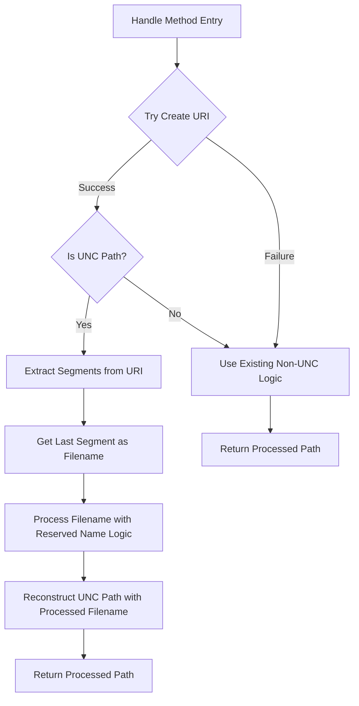

# Detailed Architectural Plan: Refactoring UNC Path Handling in ReservedNameHandler.cs using System.Uri

## 1. Executive Summary

This document provides a comprehensive architectural plan for refactoring the UNC path handling logic in `ReservedNameHandler.cs` to use `System.Uri` for improved cross-platform compatibility, robustness, and maintainability. The current implementation relies on manual string manipulation to detect and process UNC paths, which is complex and error-prone. The proposed solution leverages the `System.Uri` class for proper parsing and handling of UNC paths.

## 2. Current Implementation Analysis

### 2.1. Current Issues
- Manual string manipulation for UNC path detection (`IsUncPath` method)
- Complex manual parsing logic to extract filename components
- Platform-dependent logic that assumes Windows-style paths
- Potential edge case handling issues with various UNC path formats
- Maintenance complexity due to verbose manual parsing code

### 2.2. Current Method Structure
- `Handle` method contains separate logic branches for UNC and non-UNC paths
- `IsUncPath` method manually checks for `//` or `\\` prefixes
- Manual extraction of filename components using loops and substring operations
- Reconstruction of paths with manual string concatenation

## 3. Proposed Solution Architecture

### 3.1. Core Design
The refactored implementation will use `System.Uri` to handle UNC path detection and component extraction. This approach provides:
- Built-in cross-platform compatibility
- Robust parsing of various UNC path formats
- Proper handling of edge cases
- Simplified, more maintainable code

### 3.2. Implementation Strategy



### 3.3. Key Components

#### 3.3.1. URI Creation and Validation
- Use `Uri.TryCreate` with `UriKind.Absolute` to safely attempt URI creation
- Handle invalid paths gracefully without exceptions
- Support both `file://` and traditional UNC formats

#### 3.3.2. UNC Detection
- Use `Uri.IsUnc` property for reliable UNC path detection
- This property handles all valid UNC path formats correctly

#### 3.3. Component Extraction
- Use `Uri.Segments` property to access individual path components
- The last segment represents the filename component
- Handle paths with various numbers of segments correctly

#### 3.3.4. Path Reconstruction
- Use `Uri.Host` for the server name
- Combine path segments with the processed filename
- Maintain proper UNC path formatting

## 4. Detailed Implementation Plan

### 4.1. Updated Handle Method

```csharp
public string? Handle(string? filename)
{
    if (string.IsNullOrEmpty(filename)) return filename;

    // Attempt to create a URI from the input path
    if (Uri.TryCreate(filename, UriKind.Absolute, out Uri? uri) && uri.IsUnc)
    {
        // Handle UNC path using System.Uri
        return HandleUncPathWithUri(uri, filename);
    }
    else
    {
        // Use existing logic for non-UNC paths
        string directoryPath = Path.GetDirectoryName(filename) ?? string.Empty;
        string fileName = Path.GetFileName(filename);

        if (string.IsNullOrEmpty(fileName)) return filename;

        string? processedFileName = ProcessFileName(fileName);

        if (processedFileName == null || processedFileName == fileName)
            return filename;

        if (!string.IsNullOrEmpty(directoryPath))
        {
            return Path.Combine(directoryPath, processedFileName);
        }

        return processedFileName;
    }
}
```

### 4.2. New UNC Path Handler

```csharp
private string? HandleUncPathWithUri(Uri uri, string originalPath)
{
    var segments = uri.Segments;
    if (segments.Length == 0)
    {
        // No segments found, return original
        return originalPath;
    }

    // Get the last segment which represents the filename
    var lastSegment = segments[segments.Length - 1];
    var processedSegment = ProcessFileName(lastSegment);

    if (processedSegment == lastSegment)
    {
        // No change needed, return original
        return originalPath;
    }

    // Reconstruct the UNC path with the modified filename
    var builder = new StringBuilder();
    builder.Append(uri.Scheme);
    builder.Append("://");
    builder.Append(uri.Host);

    // Add all path segments except the last one (filename)
    for (int i = 0; i < segments.Length - 1; i++)
    {
        builder.Append(segments[i]);
    }

    // Add the processed filename segment
    builder.Append(processedSegment);

    return builder.ToString();
}
```

### 4.3. Edge Case Handling

#### 4.3.1. Server-only UNC Paths
- Paths like `\\server` or `\\server\` will have limited segments
- The implementation should handle these gracefully by returning the original path if no filename can be extracted

#### 4.3.2. Server-Share-only UNC Paths  
- Paths like `\\server\share` or `\\server\share\` 
- The implementation should handle these by treating the share as a directory component

#### 4.3.3. Invalid or Malformed UNC Paths
- Use `Uri.TryCreate` to safely handle invalid paths
- Fall back to existing non-UNC logic for malformed paths

## 5. Security Validation Preservation

### 5.1. Reserved Name Detection
- The `ProcessFileName` method remains unchanged, preserving all security validations
- All reserved Windows filenames (CON, PRN, AUX, NUL, COM1-COM9, LPT1-LPT9) continue to be detected
- Homoglyph detection continues to work through the `IUnicodeNormalizationService`

### 5.2. Homoglyph and Diacritic Protection
- Unicode normalization continues through the existing `_unicodeNormalizationService`
- Reserved name detection with combining marks removal remains intact
- Security checks for spoofing attempts are preserved

### 5.3. Insignificant Character Handling
- Processing of dots, spaces, and tabs continues as implemented
- Replacement of fully insignificant names with safe placeholders is maintained
- Leading and trailing character preservation logic remains unchanged

## 6. Design Principles Compliance

### 6.1. SOLID Principles
- **Single Responsibility Principle**: The `ReservedNameHandler` remains focused on reserved name handling, while `System.Uri` handles path parsing
- **Open/Closed Principle**: The class is open for extension but closed for modification of core security logic
- **Liskov Substitution Principle**: The new implementation maintains the same contract as the original
- **Interface Segregation Principle**: The `IReservedNameHandler` interface remains unchanged
- **Dependency Inversion Principle**: The class continues to depend on the `IUnicodeNormalizationService` abstraction

### 6.2. DRY (Don't Repeat Yourself)
- Elimination of manual path parsing logic reduces code duplication
- Centralized path handling through `System.Uri` prevents redundant implementations

### 6.3. KISS (Keep It Simple, Stupid)
- Simplified UNC path detection using built-in `IsUnc` property
- Reduced complexity through use of standard .NET classes
- Clear separation between UNC and non-UNC path handling

### 6.4. YAGNI (You Aren't Gonna Need It)
- Focus on required functionality without adding unnecessary features
- No additional dependencies or complex abstractions beyond what's needed

### 6.5. DDD (Domain-Driven Design)
- Clear domain logic separation with `ReservedNameHandler` as a domain service
- Proper encapsulation of business rules within the class

## 7. Cross-Platform Compatibility

### 7.1. System.Uri Benefits
- Built-in cross-platform path handling
- Proper parsing of various UNC path formats across operating systems
- Consistent behavior regardless of platform-specific path separators

### 7.2. Platform Considerations
- `System.Uri` handles both Windows (`\\server\share`) and Unix-style (`file://server/share`) formats
- Proper handling of different path separators and conventions
- Maintains compatibility with existing non-UNC path logic

## 8. Maintainability Improvements

### 8.1. Code Simplification
- Reduced lines of code in UNC path handling
- More readable and understandable logic
- Easier debugging and maintenance

### 8.2. Error Handling
- Graceful handling of invalid paths through `TryCreate`
- Reduced potential for string parsing errors
- Better separation of concerns

### 8.3. Testability
- Clear separation between path parsing and reserved name processing
- Easier to unit test individual components
- Better isolation of UNC-specific logic

## 9. Backward Compatibility

### 9.1. API Contract
- Public interface `IReservedNameHandler` remains unchanged
- Method signatures and return types are preserved
- All existing functionality is maintained

### 9.2. Behavior Preservation
- All existing test cases should continue to pass
- Reserved name detection behavior remains identical
- Path reconstruction maintains the same format

## 10. Performance Considerations

### 10.1. URI Creation Overhead
- `Uri.TryCreate` has minimal performance impact
- The benefit of robust parsing outweighs the small overhead
- Caching is not necessary for this use case

### 10.2. Memory Usage
- StringBuilder usage for path reconstruction is efficient
- No significant increase in memory allocation
- Proper disposal of URI objects through garbage collection

## 11. Risk Assessment

### 11.1. Potential Risks
- Changes to UNC path parsing logic could introduce regressions
- Different URI parsing behavior than manual string manipulation
- Potential differences in handling edge cases

### 11.2. Mitigation Strategies
- Comprehensive test coverage for all UNC path scenarios
- Gradual rollout and monitoring of the new implementation
- Thorough verification of edge case handling

## 12. Implementation Phases

### Phase 1: Core Refactoring
- Replace manual UNC path detection with `System.Uri`
- Implement new `HandleUncPathWithUri` method
- Maintain all existing security validations

### Phase 2: Testing and Verification
- Update existing test suite
- Add new tests for UNC path scenarios
- Perform cross-platform compatibility testing

### Phase 3: Validation and Deployment
- Security review of the new implementation
- Performance testing
- Gradual deployment with monitoring

## 13. Quality Assurance

### 13.1. Testing Strategy
- Unit tests for all UNC path scenarios
- Integration tests with existing path validation
- Cross-platform compatibility tests
- Security validation tests

### 13.2. Code Review Checklist
- Verify all security validations are preserved
- Confirm cross-platform compatibility
- Validate edge case handling
- Ensure performance requirements are met

## 14. Conclusion

This architectural plan provides a comprehensive approach to refactoring UNC path handling in `ReservedNameHandler.cs` using `System.Uri`. The proposed solution addresses all current issues while maintaining security validations and preserving existing functionality. The implementation follows best practices for design principles and ensures cross-platform compatibility and maintainability.
