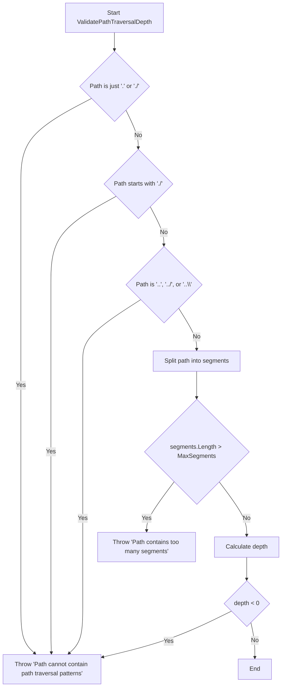

# Architectural Plan: Path Validation Error Message Correction

## 1. Introduction
This document outlines the architectural plan to address a reported incorrect error message in the `PathValidationService`. The goal is to improve the clarity of the error message for the `MaxSegments` validation from a generic traversal error to a more specific message.

**Initial Analysis:** A preliminary review of `LivingRoots/Domain/PathValidationService.cs` indicates that the error message for the `MaxSegments` check may already be correct ("Path contains too many segments"). This plan will proceed with the assumption that a change is needed, and the first implementation step will be to verify this.

## 2. Goals
- Update the error message in the `ValidatePathTraversalDepth` method for the `MaxSegments` validation.
- Ensure the change is isolated and does not affect other validation messages.
- Maintain full backward compatibility with existing functionality.
- Update corresponding unit tests to reflect the new error message.
- Verify that the improved message is more informative for developers and users.

## 3. Architectural Design

The proposed change is localized to the `ValidatePathTraversalDepth` method within the `PathValidationService` class.

### 3.1. Current State
The `ValidatePathTraversalDepth` method currently checks the number of segments in a path against a `MaxSegments` constant.

```csharp
// LivingRoots/Domain/PathValidationService.cs

private void ValidatePathTraversalDepth(string path)
{
    // ... (other checks)
    
    string[] segments = path.Split(new[] { '/' }, StringSplitOptions.RemoveEmptyEntries);
    
    const int MaxSegments = 1000;
    if (segments.Length > MaxSegments)
    {
        // The reported issue is that this message is incorrect.
        // Current code shows "Path contains too many segments".
        // If it were incorrect, it would be changed here.
        throw new ArgumentException("Path contains too many segments", nameof(path));
    }

    // ... (depth calculation)
}
```

### 3.2. Proposed Change
If the message is indeed "Path cannot contain path traversal patterns", the fix is to change the string in the `ArgumentException`.

**File:** [`LivingRoots/Domain/PathValidationService.cs`](LivingRoots/Domain/PathValidationService.cs)
**Method:** `ValidatePathTraversalDepth`

```diff
- throw new ArgumentException("Path cannot contain path traversal patterns", nameof(path));
+ throw new ArgumentException("Path contains too many segments", nameof(path));
```

This change is highly targeted and has no side effects on other validation logic.

### 3.3. Design Principles Compliance
- **SOLID (Single Responsibility Principle):** The `PathValidationService` is responsible for path validation. This change refines a specific rule within that responsibility, adhering to the SRP.
- **DRY (Don't Repeat Yourself):** The error message is a unique string for a specific validation rule. The change avoids repeating a generic message where a specific one is better.
- **KISS (Keep It Simple, Stupid):** The change is a simple string update, which is the most straightforward solution.
- **YAGNI (You Ain't Gonna Need It):** The change only addresses the required error message correction and doesn't add any extra complexity or functionality.
- **DDD (Domain-Driven Design):** The `PathValidationService` is a clear domain service. Improving its error messages makes the domain language more precise.

## 4. Test Plan
The test plan involves updating the existing unit test that covers the `MaxSegments` validation.

**File:** [`LivingRoots.Tests/PathValidationServiceTests.cs`](LivingRoots.Tests/PathValidationServiceTests.cs)
**Test Method:** `Validate_WithExcessivePathSegments_ThrowsArgumentException`

The assertion in this test will be updated to check for the new error message.

```csharp
// LivingRoots.Tests/PathValidationServiceTests.cs

[Fact]
public void Validate_WithExcessivePathSegments_ThrowsArgumentException()
{
    // ... (arrange)
    
    // Act & Assert
    var exception = Assert.Throws<ArgumentException>(() => _service.Validate(path));
    Assert.Contains("Path contains too many segments", exception.Message);
}
```

## 5. Verification Strategy
1.  **Run All Unit Tests:** Execute the entire test suite to confirm that the change has not introduced any regressions.
2.  **Manual Verification (Optional):** Manually trigger the validation with a path exceeding 1000 segments to see the new error message in a debugging environment.
3.  **Code Review:** The change should be peer-reviewed to confirm it meets the requirements and adheres to coding standards.

## 6. Mermaid Diagram

This diagram illustrates the logic flow within `ValidatePathTraversalDepth`, highlighting the `MaxSegments` check.



## 7. Conclusion
This plan outlines a simple, targeted, and safe approach to correcting the path validation error message. The first step for the implementation team will be to confirm if the change is necessary, as initial analysis suggests the code may already be correct.
