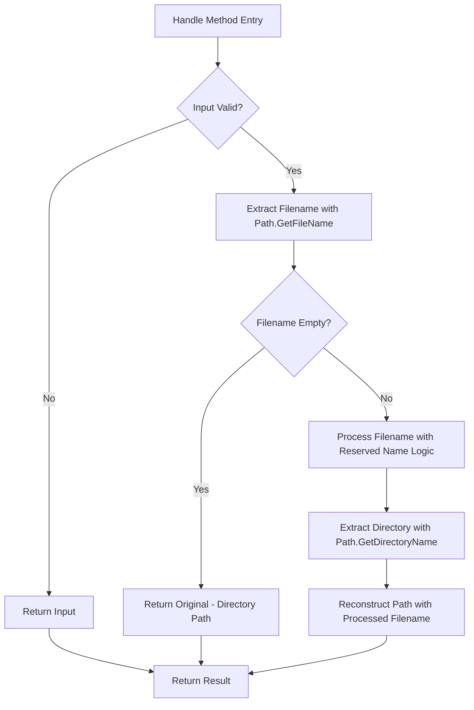

# Detailed Architectural Plan: Simplifying UNC Path Handling in ReservedNameHandler.cs

## 1. Executive Summary

This document provides a comprehensive architectural plan for refactoring the UNC path handling logic in `ReservedNameHandler.cs` to leverage .NET's built-in `Path.GetFileName` and `Path.GetDirectoryName` methods. The current implementation uses complex manual UNC path parsing that can be simplified while maintaining all security validations. This refactoring will improve maintainability, reduce complexity, and ensure consistent cross-platform behavior.

## 2. Current Implementation Analysis

### 2.1. Current Issues
- Manual string manipulation for UNC path detection (`IsUncPath` method)
- Separate code paths for UNC and non-UNC paths creating duplication
- Complex manual parsing logic to extract filename components
- Potential edge case handling issues with various UNC path formats
- Maintenance complexity due to verbose manual parsing code

### 2.2. Current Method Structure
- `Handle` method contains separate logic branches for UNC and non-UNC paths
- `IsUncPath` method manually checks for `//` or `\\` prefixes
- Manual extraction and reconstruction of path components
- Separate processing logic for each path type

## 3. Proposed Solution Architecture

### 3.1. Core Design
The refactored implementation will use .NET's built-in `Path.GetFileName` and `Path.GetDirectoryName` methods which natively handle UNC paths correctly. This approach provides:
- Built-in cross-platform compatibility
- Robust parsing of various UNC path formats
- Proper handling of edge cases
- Simplified, more maintainable code

### 3.2. Implementation Strategy



### 3.3. Key Components

#### 3.3.1. Unified Path Processing
- Use `Path.GetFileName` to extract the filename component from any path (UNC, local, rooted, relative)
- Use `Path.GetDirectoryName` to extract the directory component from any path
- Both methods natively handle UNC paths correctly across platforms

#### 3.3.2. Path Reconstruction
- Use `Path.Combine` to reconstruct the full path with the processed filename
- This ensures proper path separator handling across platforms

#### 3.3.3. Directory Path Preservation
- When `Path.GetFileName` returns empty (directory paths ending with separators), return the original unchanged
- This preserves the existing behavior for directory-only paths

## 4. Detailed Implementation Plan

### 4.1. Updated Handle Method

```csharp
public string? Handle(string? filename)
{
    if (string.IsNullOrEmpty(filename)) return filename;

    // First, normalize Unicode characters to handle diacritics and homoglyphs
    string? normalizedInput = _unicodeNormalizationService?.Normalize(filename);
    
    // Security fix: Add null check for normalizedInput to prevent validation bypass
    if (normalizedInput == null)
        throw new ArgumentException("Filename normalization returned null, validation cannot proceed", nameof(filename));

    // Extract the filename component using Path.GetFileName which handles UNC paths correctly
    string fileName = Path.GetFileName(normalizedInput);

    // If Path.GetFileName returns empty (for directory paths ending with separator), return original
    if (string.IsNullOrEmpty(fileName)) return filename;

    // Extract the directory path using Path.GetDirectoryName which handles UNC paths correctly
    string directoryPath = Path.GetDirectoryName(normalizedInput) ?? string.Empty;

    // Process just the filename component for reserved names
    string? processedFileName = ProcessFileNameInternal(fileName);

    // If no change was made to the filename component, return the original path
    if (processedFileName == null || processedFileName == fileName)
        return filename;

    // Reconstruct the full path with the processed filename component
    if (!string.IsNullOrEmpty(directoryPath))
    {
        return Path.Combine(directoryPath, processedFileName);
    }

    return processedFileName;
}
```

### 4.2. Elimination of Manual UNC Detection
- Remove the `IsUncPath` method entirely
- Remove the separate UNC and non-UNC processing branches
- All path types are now handled through the unified approach

### 4.3. Edge Case Handling

#### 4.3.1. Directory-Only Paths
- Paths ending with directory separators (e.g., `C:\temp\`, `\\server\share\`) will have empty filename components
- The implementation will return the original path unchanged, preserving existing behavior

#### 4.3.2. UNC Paths
- UNC paths like `\\server\share\file.txt` will be correctly parsed
- `Path.GetFileName` will return `file.txt`
- `Path.GetDirectoryName` will return `\\server\share`
- The processed path will be reconstructed as `\\server\share\file_.txt` if `file` is reserved

#### 4.3. Rooted and Relative Paths
- Standard paths will continue to work as before
- The unified approach handles all path formats consistently

## 5. Security Validation Preservation

### 5.1. Reserved Name Detection
- The `ProcessFileNameInternal` method remains unchanged, preserving all security validations
- All reserved Windows filenames (CON, PRN, AUX, NUL, COM1-COM9, LPT1-LPT9) continue to be detected
- Homoglyph detection continues to work through the `IUnicodeNormalizationService`

### 5.2. Homoglyph and Diacritic Protection
- Unicode normalization continues through the existing `_unicodeNormalizationService`
- Reserved name detection with combining marks removal remains intact
- Security checks for spoofing attempts are preserved

### 5.3. Insignificant Character Handling
- Processing of dots, spaces, and tabs continues as implemented
- Replacement of fully insignificant names with safe placeholders is maintained
- Leading and trailing character preservation logic remains unchanged

### 5.4. Extension Handling
- The `FindFirstExtensionIndex` method continues to work correctly with extracted filenames
- Multi-part extension handling (e.g., `COM1.tar.gz`) remains intact
- Extension preservation logic is unchanged

## 6. Design Principles Compliance

### 6.1. SOLID Principles
- **Single Responsibility Principle**: The `ReservedNameHandler` remains focused on reserved name handling
- **Open/Closed Principle**: The class is open for extension but closed for modification of core security logic
- **Liskov Substitution Principle**: The new implementation maintains the same contract as the original
- **Interface Segregation Principle**: The `IReservedNameHandler` interface remains unchanged
- **Dependency Inversion Principle**: The class continues to depend on the `IUnicodeNormalizationService` abstraction

### 6.2. DRY (Don't Repeat Yourself)
- Elimination of duplicate code between UNC and non-UNC processing paths
- Single implementation for all path types reduces code duplication
- Centralized path handling through .NET built-ins prevents redundant implementations

### 6.3. KISS (Keep It Simple, Stupid)
- Simplified path handling using built-in .NET methods
- Reduced complexity through use of standard .NET classes
- Clear, single path for all path processing

### 6.4. YAGNI (You Aren't Gonna Need It)
- Focus on required functionality without adding unnecessary features
- No additional dependencies or complex abstractions beyond what's needed
- Minimal code changes to achieve the objective

### 6.5. DDD (Domain-Driven Design)
- Clear domain logic separation with `ReservedNameHandler` as a domain service
- Proper encapsulation of business rules within the class
- Domain-focused implementation without infrastructure concerns

## 7. Cross-Platform Compatibility

### 7.1. .NET Path Methods Benefits
- `Path.GetFileName` and `Path.GetDirectoryName` are built-in .NET methods
- Proper handling of various path formats across operating systems
- Consistent behavior regardless of platform-specific path separators
- Native UNC path support on Windows, and proper handling on Unix systems

### 7.2. Platform Considerations
- The implementation leverages .NET's cross-platform path handling capabilities
- Proper handling of different path separators and conventions
- Maintains compatibility with existing path logic

## 8. Maintainability Improvements

### 8.1. Code Simplification
- Reduced lines of code by eliminating duplicate UNC/non-UNC logic
- More readable and understandable logic
- Easier debugging and maintenance
- Single code path to maintain instead of multiple branches

### 8.2. Error Handling
- Leverage .NET's robust error handling for path operations
- Reduced potential for string parsing errors
- Better separation of concerns between path parsing and business logic

### 8.3. Testability
- Clear separation between path parsing (handled by .NET) and reserved name processing
- Easier to unit test individual components
- Better isolation of business logic from path parsing concerns

## 9. Backward Compatibility

### 9.1. API Contract
- Public interface `IReservedNameHandler` remains unchanged
- Method signatures and return types are preserved
- All existing functionality is maintained

### 9.2. Behavior Preservation
- All existing test cases should continue to pass
- Reserved name detection behavior remains identical
- Path reconstruction maintains the same format
- UNC path handling behavior is preserved but simplified

## 10. Performance Considerations

### 10.1. .NET Path Method Efficiency
- `Path.GetFileName` and `Path.GetDirectoryName` are optimized .NET methods
- No performance degradation compared to manual string manipulation
- The benefit of robust parsing outweighs minimal performance considerations
- Proper memory usage through .NET's internal optimizations

### 10.2. Memory Usage
- No significant increase in memory allocation
- Efficient use of .NET's internal path processing
- Proper disposal of temporary objects through garbage collection

## 11. Risk Assessment

### 11.1. Potential Risks
- Changes to path parsing logic could introduce regressions
- Different behavior than manual string manipulation in edge cases
- Potential differences in handling platform-specific paths

### 11.2. Mitigation Strategies
- Comprehensive test coverage for all path scenarios (UNC, local, rooted, relative)
- Thorough verification of edge case handling
- Gradual implementation with extensive testing
- Preservation of all existing security validations

## 12. Implementation Phases

### Phase 1: Core Refactoring
- Replace manual UNC path detection with .NET built-in methods
- Consolidate separate UNC and non-UNC logic paths
- Maintain all existing security validations
- Remove the `IsUncPath` method

### Phase 2: Testing and Verification
- Update existing test suite to validate the new implementation
- Add new tests for path scenarios if needed
- Perform cross-platform compatibility testing
- Verify all security validations remain intact

### Phase 3: Validation and Deployment
- Security review of the new implementation
- Performance testing to ensure no degradation
- Final validation with existing test suite

## 13. Quality Assurance

### 13.1. Testing Strategy
- Unit tests for all path scenarios (UNC, local, rooted, relative)
- Integration tests with existing path validation
- Cross-platform compatibility tests
- Security validation tests
- Edge case testing for directory-only paths

### 13.2. Code Review Checklist
- Verify all security validations are preserved
- Confirm cross-platform compatibility
- Validate edge case handling
- Ensure performance requirements are met
- Verify that the unified approach works correctly for all path types

## 14. Expected Benefits

### 14.1. Code Quality
- Significant reduction in code complexity
- Improved readability and maintainability
- Elimination of duplicate code paths
- Better adherence to established design principles

### 14.2. Reliability
- Leverage .NET's battle-tested path handling methods
- Better handling of edge cases and unusual path formats
- Reduced likelihood of path parsing bugs
- Consistent behavior across platforms

### 14.3. Maintainability
- Single code path to maintain and debug
- Clear separation between infrastructure (path parsing) and business logic (reserved names)
- Easier to extend with additional path handling features if needed

## 15. Conclusion

This architectural plan provides a comprehensive approach to simplifying UNC path handling in `ReservedNameHandler.cs` by leveraging .NET's built-in `Path.GetFileName` and `Path.GetDirectoryName` methods. The proposed solution addresses all current issues while maintaining security validations and preserving existing functionality. The implementation follows best practices for design principles and ensures cross-platform compatibility and maintainability.
