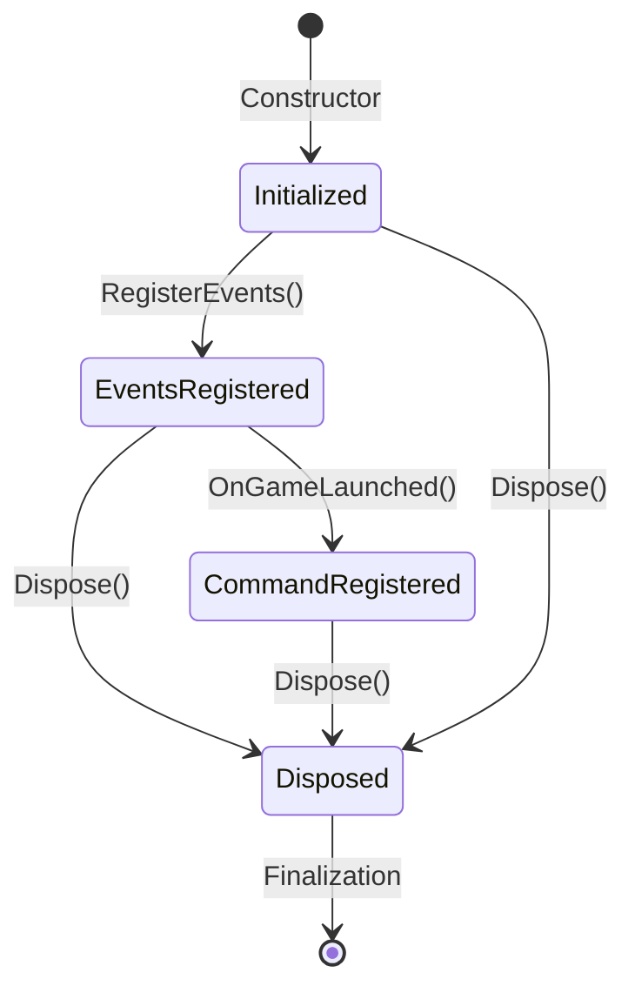

# Thread Safety Architectural Plan: Improving ModController Disposal Logic

## Current State Analysis

The current ModController implementation already uses atomic state management with bit flags:
- Uses a single `int _state` field with bit flags: `0x01` = events registered, `0x02` = command registered, `0x04` = disposed
- Implements thread-safe operations using `Volatile.Read`, `Interlocked.CompareExchange`, `Interlocked.And`, and `Interlocked.Or`
- Uses `TrySetStateOnce` method to ensure atomic flag setting with proper thread safety

## Goals

1. **Consolidate multiple integer flags** into a more maintainable atomic state management approach
2. **Reduce repeated disposal checks** throughout methods by centralizing state validation
3. **Maintain the same functionality** while improving thread safety
4. **Follow SOLID, DRY, KISS, YAGNI, and DDD principles**
5. **Ensure all existing functionality remains in place**
6. **Handle disposal properly** with improved atomic operations

## Proposed Architecture

### 1. Enhanced Atomic State Management

Instead of using bit flags in a single integer, we'll use an enumeration-based approach with a more explicit state management system:

```csharp
public enum ControllerState
{
    Initialized = 0,      // Initial state after construction
    EventsRegistered = 1, // After RegisterEvents() succeeds
    CommandRegistered = 2, // After command registration in OnGameLaunched()
    Disposed = 4         // After Dispose() is called
}
```

This approach provides better type safety and clarity than bit flags.

### 2. Simplified State Management

Replace the current bit flag system with a cleaner approach using `AtomicReference` pattern:

```csharp
// Instead of:
private int _state = 0;
private const int EventsRegisteredFlag = 0x01;
private const int CommandRegisteredFlag = 0x02;
private const int DisposedFlag = 0x04;

// Use:
private volatile ControllerState _state = ControllerState.Initialized;
```

### 3. Centralized State Validation

Create a centralized state validation system that reduces repeated disposal checks:

```csharp
private bool ValidateState(ControllerState requiredState, out string errorMessage)
{
    var currentState = Volatile.Read(ref _state);
    
    if (currentState == ControllerState.Disposed)
    {
        errorMessage = "Controller is disposed";
        return false;
    }
    
    // Additional state validation logic as needed
    errorMessage = null;
    return true;
}
```

### 4. Improved Thread Safety Patterns

Current implementation already uses proper atomic operations, but we can improve by:

- Using `Interlocked.CompareExchange` more systematically
- Reducing the number of atomic operations by batching state changes
- Implementing a state transition matrix to ensure valid state transitions

## Detailed Implementation Plan

### Phase 1: State Management Refactoring

1. **Replace bit flags with enum-based state management**
   - Create `ControllerState` enum with clear state definitions
   - Replace `_state` field with the new enum type
   - Update all state checking methods to use the new approach

2. **Create state transition validation**
   - Implement state transition matrix to ensure only valid transitions
   - Prevent invalid state changes (e.g., going from Disposed back to EventsRegistered)

3. **Centralize disposal checks**
   - Create a single `EnsureNotDisposed()` method that throws if disposed
   - Replace multiple disposal checks with calls to this method
   - Add `TryEnsureNotDisposed()` for non-throwing validation

### Phase 2: Method Simplification

1. **Refactor RegisterEvents() method**
   - Simplify the state checking logic
   - Reduce atomic operations by batching state changes when possible
   - Maintain idempotent behavior

2. **Refactor UnregisterEvents() method**
   - Simplify the internal cleanup logic
   - Ensure proper cleanup regardless of current state
   - Maintain thread safety during cleanup

3. **Refactor OnGameLaunched() method**
   - Simplify command registration logic
   - Ensure proper handler cleanup after first execution
   - Maintain thread safety during concurrent calls

### Phase 3: Enhanced Atomic Operations

1. **Optimize TrySetStateOnce() method**
   - Improve the compare-and-swap loop for better performance
   - Add proper state transition validation
   - Ensure thread safety during state changes

2. **Add state transition logging**
   - Log state changes for debugging purposes
   - Maintain existing logging patterns for consistency

## SOLID, DRY, KISS, YAGNI, and DDD Compliance

### SOLID Principles
- **Single Responsibility**: Each method will have a single, clear responsibility related to state management
- **Open/Closed**: The system will be open for extension but closed for modification of core state logic
- **Liskov Substitution**: The new state system will maintain the same interface contract
- **Interface Segregation**: No interface changes needed, maintaining existing contracts
- **Dependency Inversion**: No dependency changes required

### DRY (Don't Repeat Yourself)
- Eliminate repeated disposal checks by centralizing state validation
- Create reusable state validation methods
- Consolidate similar state checking logic

### KISS (Keep It Simple, Stupid)
- Use clear, understandable state names instead of bit flags
- Reduce complexity in state validation methods
- Maintain simple, straightforward logic flow

### YAGNI (You Aren't Gonna Need It)
- Don't add complex state management features that aren't needed
- Keep only the states necessary for current functionality
- Avoid over-engineering for potential future states

### DDD (Domain-Driven Design)
- Use clear, domain-appropriate state names that reflect the controller's lifecycle
- Maintain Ubiquitous Language in state definitions
- Ensure state transitions reflect the business logic of the controller

## State Transition Diagram



## Thread Safety Improvements

### Current Issues
- Multiple atomic operations in sequence can create race conditions
- Complex bit flag operations may be harder to reason about
- State validation is scattered across multiple methods

### Proposed Improvements
1. **Batched State Changes**: Combine multiple state changes into single atomic operations when possible
2. **Clear State Transitions**: Define clear, validated state transitions to prevent invalid states
3. **Centralized Validation**: Move all state validation logic to a single, well-tested location
4. **Improved Atomic Operations**: Use more efficient atomic operations where possible

## Backward Compatibility

All existing functionality will be preserved:
- Public interface remains unchanged
- Event registration behavior remains identical
- Command registration behavior remains identical
- Disposal behavior remains identical
- All existing tests should continue to pass

## Risk Mitigation

1. **Thorough Testing**: Maintain and enhance existing test coverage
2. **Gradual Refactoring**: Implement changes in small, testable steps
3. **State Validation**: Add comprehensive state validation to prevent invalid transitions
4. **Performance Monitoring**: Ensure no performance degradation from the refactoring

## Success Metrics

1. **Thread Safety**: No race conditions or atomic operation issues
2. **Maintainability**: Cleaner, more readable code with reduced complexity
3. **Performance**: Same or better performance than current implementation
4. **Test Coverage**: All existing tests continue to pass
5. **Functionality**: All existing functionality preserved